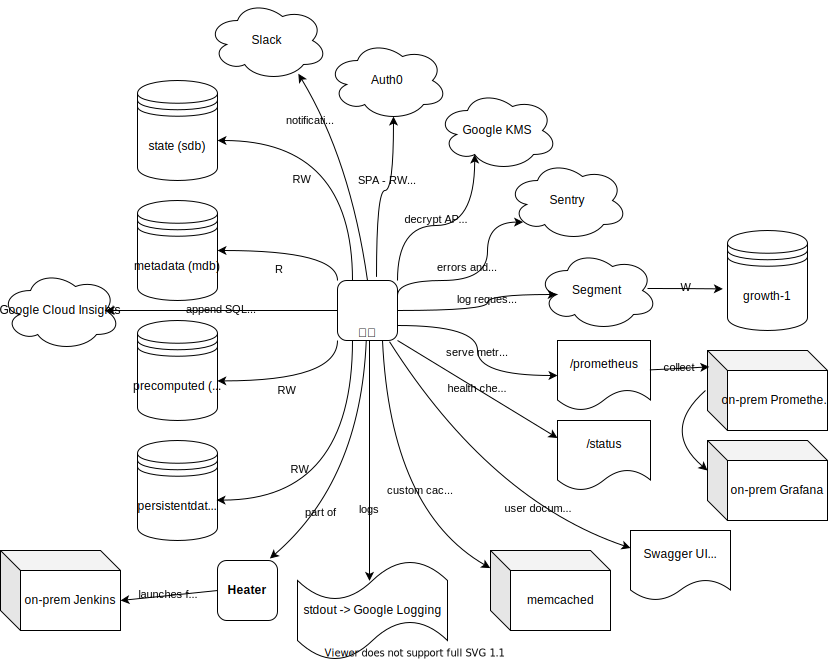

# athenian-api  
API layer to glue them all.

Athenian API server follows the [OpenAPI 3 standard](https://github.com/OAI/OpenAPI-Specification/blob/master/versions/3.0.3.md)
and is implemented in [aiohttp](https://github.com/aio-libs/aiohttp) (Python).

### Schema

The API schema is [athenianco/api-spec](https://github.com/athenianco/api-spec). You can quickly view it in [editor.swagger.io](https://editor.swagger.io/) or at [api.athenian.co/v1/ui](https://api.athenian.co/v1/ui/).

### Server

See [`server/README.md`](server/README.md) for the info about how to launch the API server.

### Deployment

See [`DEPLOYMENT.md`](DEPLOYMENT.md).

### Security

See [`SECURITY.md`](SECURITY.md).

### License

Proprietary until further notice.
