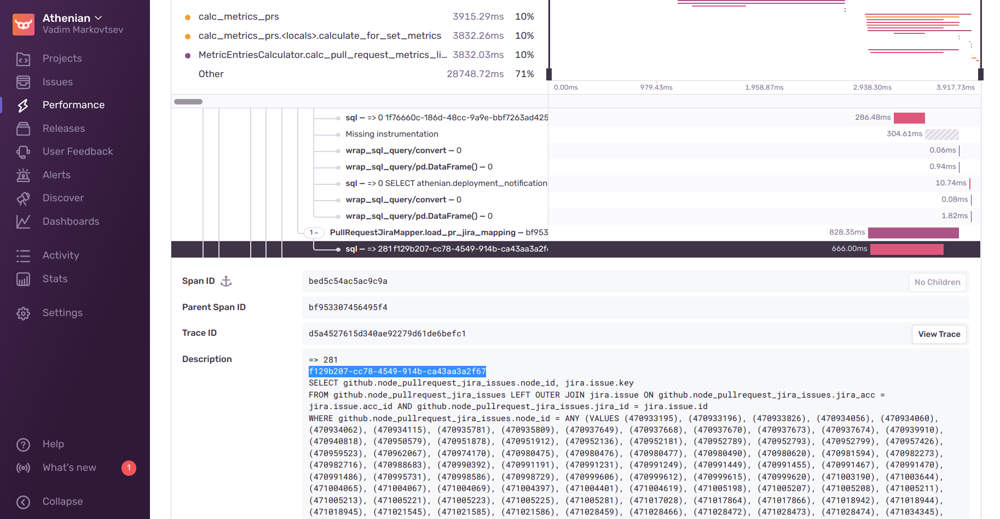
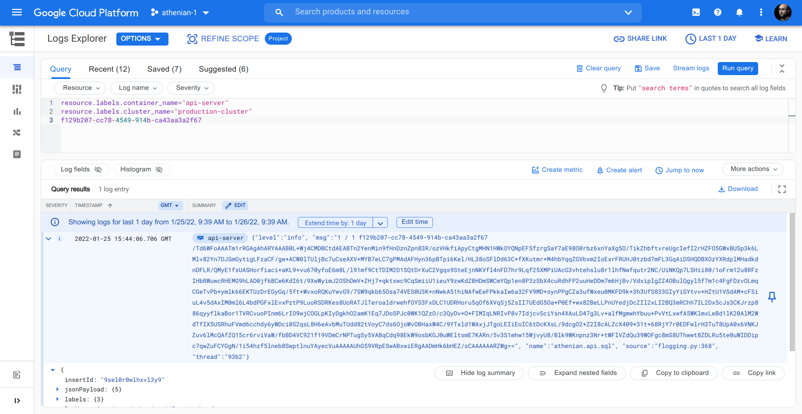

# Hacking API performance

## Debugging SQL

Open https://sentry.io/organizations/athenianco/performance/?environment=production&project=1867351

Sort by P95 and choose the victim. Enter that endpoint and open a suspiciously slow example.

Every "sql" operation either shows the full SQL query with parameters or the truncated query with GUID in the header.



Copy-paste this GUID to Logs Explorer, set the appropriate time interval for the search.



Copy-paste the base64 string to a local file. Note: only the base64 string, no GUIDs, no footers, etc.
Then execute:

```
cat /tmp/base64 | python3 athenian/api/hacks/show_sql.py >/tmp/query
```

## API performance notes - September 2020

The API precomputes timestamps of various PR events in the pdb, such as when they were created or released.
It saves them as binary pickle-s (serialized Python struct-s) in three tables:
* `github.done_pull_request_facts` - for those PRs which are already released or otherwise closed unmerged.
* `github.merged_pull_request_facts` - for those PRs which are merged (no matter if they are released or not).
* `github.open_pull_request_facts` - for open PRs.
Given a PR, it always falls in one of those three categories, and we are able to load its timestamps from the pdb.
There are some edge cases ofc, like brand new PRs or force push drops.
When we calculate the metrics, we fetch all the timestamps for our thousands of PRs. Then we aggregate them and return the response.
In an ideal case, the endpoint takes a few seconds even for huge accounts / huge timespans and everybody is happy.
However, we support dynamic updates, with the guarantee that we return metrics / filter PRs using the most up to date metadata state.
This means that e.g. we query github_merged_pull_request_facts, find out that some PR can potentially become released, and add it to the list of PRs who need the release matching. As soon as we have a repo who needs the releases matching, we query all its releases in the timespan, query commit DAGs for each release, and determine the release ownership of each commit. The former runs in Cython and scales to huge monorepos with millions of commits without much problem.
Querying commit DAGs must work fast, too, because it is a recursive SQL to traverse github_node_commit and it can elapse minutes on big repos. We apply a series of clever tricks and heuristics to limit the depth of our SQL DAG traversal so that we load DAGs incrementally.
It has recently turned out that fetching all the releases for a few big repositories can take too much time and dominate the endpoint's trace. So we'll precompute them, too, basically repeating the contents of the github_releases_compat view inside the pdb. We have to keep it updated, so there is a certain pain there.
In the end, `/metrics/pull_requests` should scale to W. size without doubts.
Where we have doubts is filtering PRs, because we can no longer "cheat" there with precomputed timestamps. We have to return JSON for each PR in the timespan, and if you've got 10k PRs, well... good luck with querying mdb. There is still a way out there, nevertheless! We are lucky that the users do not really want all 10k PRs in their table at once, and we can paginate or limit the number of returned results by truncating the sorted sequence. So we should be able trade the number of PRs for speed there and eventually scale to 1k repositories, too.
There are even more doubts in the other endpoints, which were not optimized so extensively. At big scale, a single stupid thing like a missing index or filtering client-side can explode the endpoint. This is a minefield and the only way to dismantle it is by trial and effort.